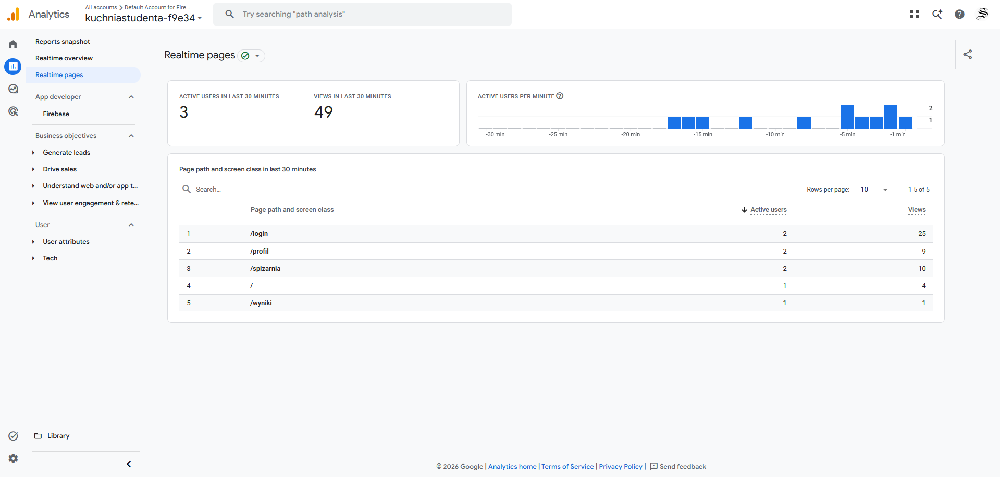
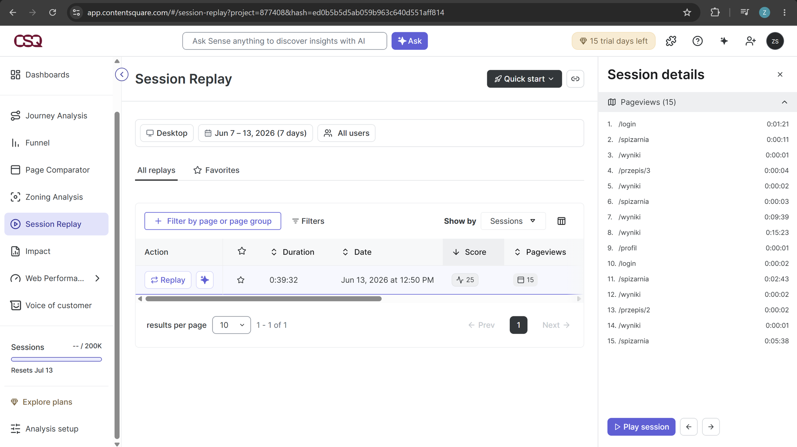
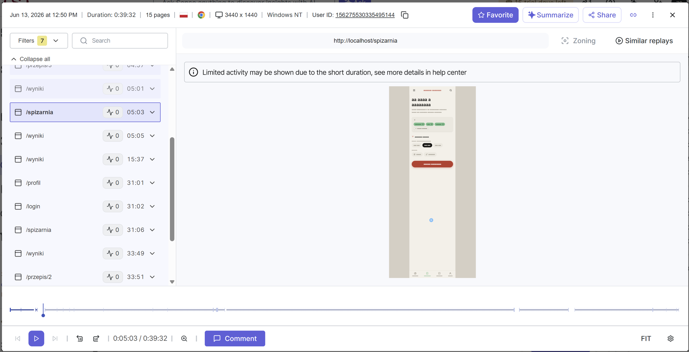
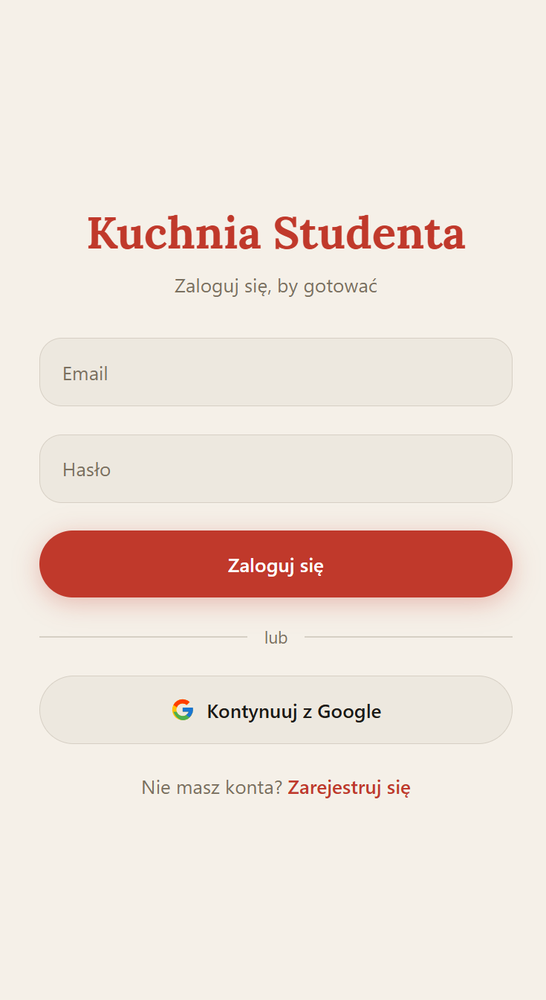
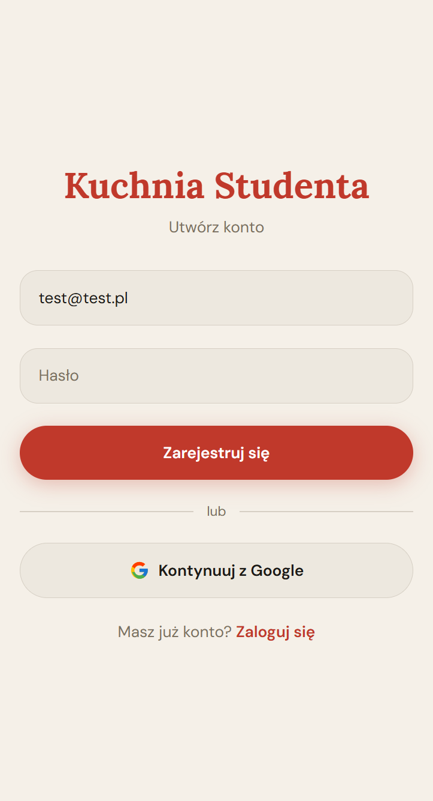
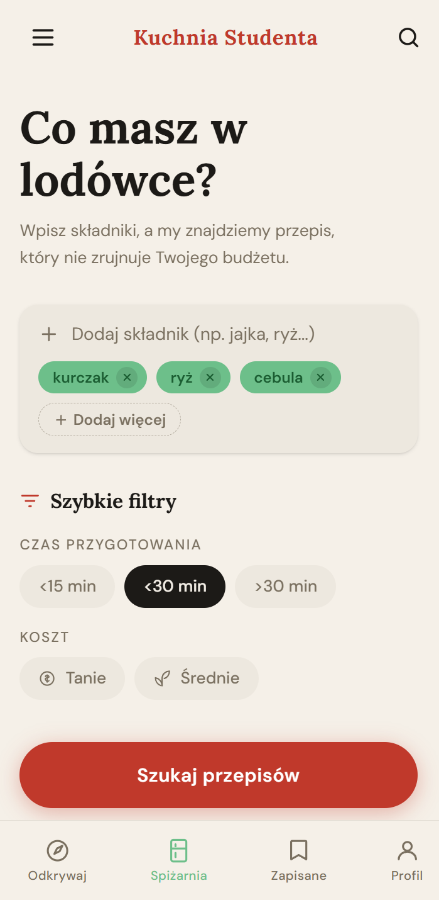
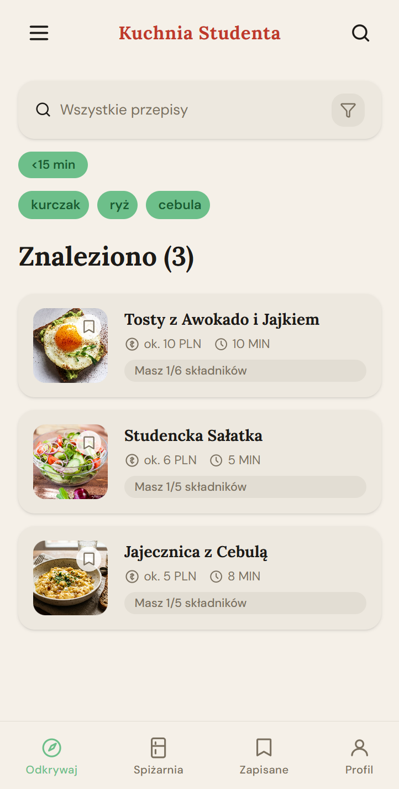
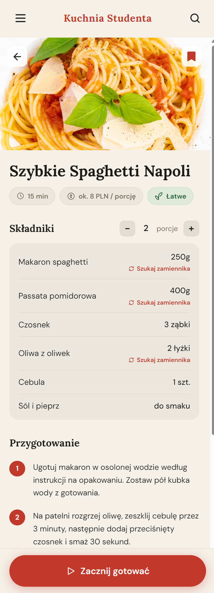
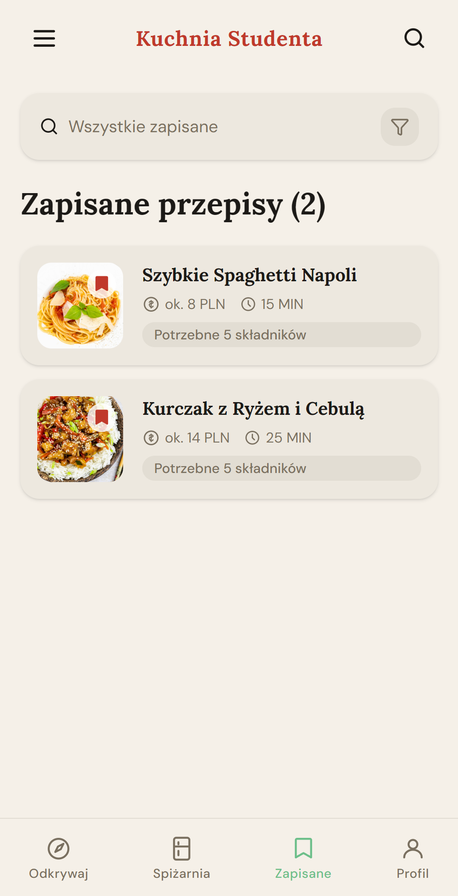
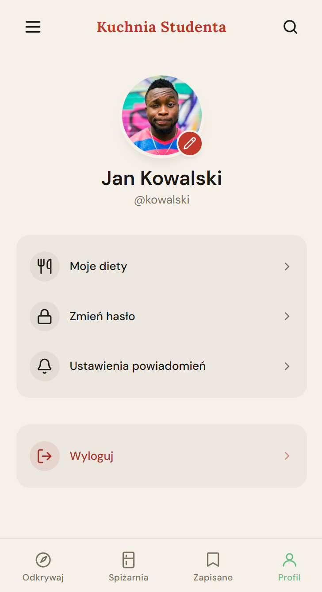

# Kuchnia Studenta

Kuchnia Studenta to aplikacja webowa napisana w React, która ułatwia wyszukiwanie prostych i budżetowych przepisów na podstawie dostępnych składników. Aplikacja zawiera logowanie użytkownika, wyszukiwarkę przepisów, zapisywanie ulubionych pozycji, widok profilu oraz integrację z narzędziami analitycznymi.

## Funkcjonalności

- logowanie i rejestracja użytkownika,
- logowanie za pomocą konta Google,
- zabezpieczenie wybranych tras dla zalogowanych użytkowników,
- dodawanie składników dostępnych w spiżarni,
- filtrowanie przepisów według czasu przygotowania i kosztu,
- wyświetlanie listy wyników z paginacją,
- wyświetlanie szczegółów przepisu,
- przeliczanie składników na liczbę porcji,
- wyszukiwanie zamienników wybranych składników,
- tryb gotowania krok po kroku,
- zapisywanie przepisów w ulubionych,
- widok profilu użytkownika,
- widok ustawień aplikacji,
- menu boczne oraz dolna nawigacja,
- obsługa strony 404,
- integracja z Google Analytics,
- integracja z Hotjar / ContentSquare.

## Technologie

- React 19
- Vite
- React Router
- Tailwind CSS
- Firebase Authentication
- Firebase Analytics
- React GA4
- Hotjar Browser
- Lucide React
- Local Storage

## Struktura projektu

```txt
src/
  assets/       # zasoby graficzne
  components/   # komponenty wielokrotnego użytku
  context/      # kontekst autoryzacji
  hooks/        # hooki aplikacyjne
  layouts/      # układy wspólne dla widoków
  pages/        # strony podłączone do routingu
  screens/      # główne widoki aplikacji
```

## Routing

Aplikacja korzysta z React Router. Dostępne trasy:

- `/login` - logowanie i rejestracja,
- `/spizarnia` - dodawanie składników,
- `/wyniki` - wyniki wyszukiwania,
- `/przepis/:id` - szczegóły przepisu,
- `/przepis/:id/gotowanie` - tryb gotowania,
- `/zapisane` - zapisane przepisy,
- `/profil` - profil użytkownika,
- `/ustawienia` - ustawienia aplikacji,
- `*` - strona błędu 404.

Trasy aplikacji, poza ekranem logowania, są chronione i wymagają zalogowanego użytkownika.

## Uruchomienie projektu

Instalacja zależności:

```bash
npm install
```

Uruchomienie aplikacji w trybie deweloperskim:

```bash
npm run dev
```

Budowanie wersji produkcyjnej:

```bash
npm run build
```

Sprawdzenie kodu narzędziem ESLint:

```bash
npm run lint
```

## Autoryzacja

Autoryzacja została zrealizowana przy użyciu Firebase Authentication. Aplikacja obsługuje logowanie i rejestrację przez email oraz hasło, a także logowanie za pomocą konta Google.

Konfiguracja Firebase znajduje się w pliku `src/firebase.jsx`.

## Google Analytics

Aplikacja jest zintegrowana z Google Analytics 4. Pomiar obejmuje wysyłanie page view przy zmianie trasy w aplikacji React.

Implementacja:

- `src/App.jsx` - inicjalizacja Google Analytics,
- `src/components/AnalyticsListener.jsx` - rejestrowanie zmian tras,
- `src/firebase.jsx` - konfiguracja Firebase i identyfikator pomiaru.

Zrzut ekranu z Google Analytics:



## Hotjar / ContentSquare

Aplikacja jest zintegrowana z Hotjar / ContentSquare. Narzędzie rejestruje sesje użytkowników oraz przejścia pomiędzy ekranami aplikacji.

Implementacja:

- `src/hooks/useHotjar.js` - inicjalizacja Hotjar,
- `src/App.jsx` - identyfikacja zalogowanego użytkownika.

Zrzuty ekranu z Hotjar / ContentSquare:





## Zrzuty ekranu aplikacji

### Logowanie



### Rejestracja



### Spiżarnia



### Wyniki wyszukiwania



### Szczegóły przepisu



### Zapisane przepisy



### Profil użytkownika



## Deploy

Projekt zawiera konfigurację deployu dla Netlify w pliku `netlify.toml`.

Konfiguracja:

- komenda budowania: `npm run build`,
- katalog publikacji: `dist`,
- przekierowanie SPA: `/* -> /index.html`.
